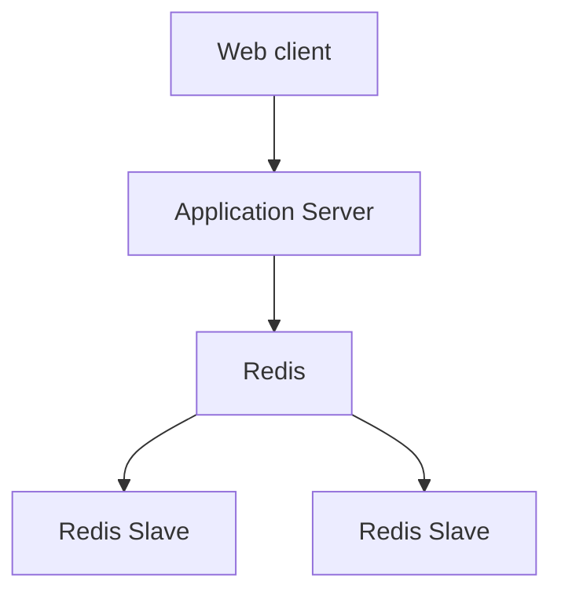
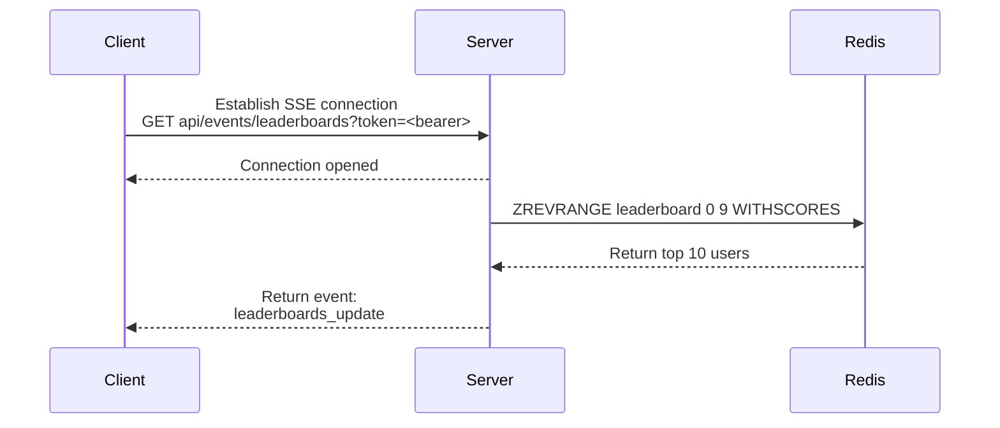
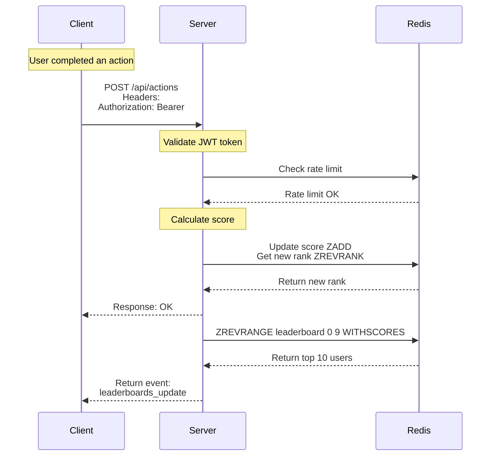

# Real-time Leaderboards Service

## Table of Contents

- [Real-time Leaderboards Service](#real-time-leaderboards-service)
  - [Table of Contents](#table-of-contents)
  - [Description](#description)
  - [High-Level Architecture](#high-level-architecture)
    - [Web Client](#web-client)
    - [Application Server](#application-server)
    - [Redis](#redis)
  - [Execution Flow](#execution-flow)
    - [Initial Flow](#initial-flow)
    - [Score Update Flow](#score-update-flow)
  - [Security Measures](#security-measures)
    - [JWT Token-Based Authentication](#jwt-token-based-authentication)
    - [Server-Side Validation](#server-side-validation)
    - [Monitoring and Audit](#monitoring-and-audit)
  - [Additional Improvements \& Considerations](#additional-improvements--considerations)
    - [Leaderboard Tiers](#leaderboard-tiers)
    - [Graceful Degradation](#graceful-degradation)
    - [Client-Side Optimistic Updates](#client-side-optimistic-updates)
    - [User Profiles Optimization](#user-profiles-optimization)

---

## Description

- This document outlines the design of a real-time leaderboard service for tracking and displaying user scores.
- Key features include:
  - Real-time score updates broadcasted to all connected clients.
  - Master-slave Redis replication for high availability.
  - Rate limiting to prevent abuse.
  - Security measures including token validation and server-side score calculation.

## High-Level Architecture



### Web Client
- Displays the leaderboards UI.
- Upon user's completing an action, sends an authenticated POST request to server for action completion.
- Maintains an SSE (Server-Sent Events) connection from server for receiving real-time leaderboards updates.

### Application Server
- Receives POST request from client.
- Performs authentication on user's jwt token.
- Calulates user's new score and save to Redis Sorted Set.
- Manages an SSE connection to client for broadcasting real-time leaderboards updates.

**REST `POST /api/actions`**

- Authentication: JWT Bearer.
- Request Headers:

```
Authorization: Bearer <jwt_token>
Content-Type: application/json
```

- Example Request Body:

```json
{
    "actionType": "action_completed",
    "metadata": {
        "level": 5,
        "duration": 120
    }
}
```

- Example Response Success:

```json
{
    "message": "Ok",
    "data": {
        "totalScore": 15850,
        "scoreIncrement": 100,
        "newRank": 3,
        "previousRank": 10
    }
}
```

**SERVER-SENT EVENTS `GET api/events/leaderboards`**

- Authentication: JWT Bearer in query string.
- Example Events:

```json
{
    "event": "score_update",
    "data": {
        "userId": "uuid-1",
        "username": "player123",
        "newScore": 15850,
        "oldScore": 15750,
        "newRank": 1,
        "oldRank": 2
    }
}

{
    "type": "leaderboards_update",
    "data": [
        {
            "rank": 1,
            "userId": "uuid-1",
            "username": "player123",
            "score": 15850
        },
        ...
    ]
}

{
    "type": "heartbeat",
    "data": {
        "timestamp": "2024-01-15T10:30:30Z"
    }
}
```

### Redis
- Caches user' score in a **Sorted Set** which provides automatic ranking based on score values.
- **Master-Slaves** replication to avoid single point of failure and data lost when disaster.
- Master node handles write operations. Slave nodes handle read operations.

```bash
# Add or update user score
ZADD leaderboard 1500 "user-uuid-123"

# Increment user score
ZINCRBY leaderboard 100 "user-uuid-123"

# Get top 10 users
ZREVRANGE leaderboard 0 9 WITHSCORES

# Get user's score
ZSCORE leaderboard "user-uuid-123"

# Get user's rank (0-based index -> rank 0 = top 1)
ZREVRANK leaderboard "user-uuid-123"

# Get total number of users
ZCARD leaderboard
```

- Implement multiple layers of rate limiting:
  - Per User.
  - Per IP.
  - Per Action Type.

## Execution Flow

### Initial Flow



### Score Update Flow



## Security Measures

### JWT Token-Based Authentication

- All score-modifying actions must require valid JWT tokens.
- Tokens should be short-lived (15-60 minutes).
- Implement refresh token mechanism for seamless user experience.
- Include user_id and permissions in token claims.

```json
{
  "sub": "user-uuid-123",
  "username": "player123",
  "iat": 1701950400,
  "exp": 1701954000,
  "permissions": ["score:update", "leaderboard:view"]
}
```

### Server-Side Validation

- Action Type Validation:
  - Reject unknown or invalid action types.
  - Each action type has predefined score values.
- Score Calculation:
  - Server calulates scores, not client.
  - Score values are configured server-side based on action type.

### Monitoring and Audit

- Alert on suspicious patterns (rapid score increases, unusual action patterns).
- Log all score modifications with user_id, IP, timestamp, and action details.

## Additional Improvements & Considerations

### Leaderboard Tiers

- **Problem**: Only one leaderboards top 10 users get recognition, reducing engagement for others.
- **Improvement**:
  - Implement multiple leaderboard tiers (Global Top 100, Regional, Friends).
  - Show user's current rank even if not in top 10.
  - Implement achievement badges for reaching certain ranks.

### Graceful Degradation

- **Problem**: System failures could break the entire user experience.
- **Improvement**:
  - If SSE fails, fall back to long-polling (every 5-10 seconds).
  - Show cached data with "delayed" indicator if live updates fail.
  - Provide offline mode with queue sync when connection restored.

### Client-Side Optimistic Updates

- **Problem**: Users have to wait for server calculations and events to see their score updates.
- **Improvement**:
  - Implement client-side optimistic UI updates (show change immediately).
  - Roll back if server rejects the action.
  - Show loading states during verification.
  - Add visual feedback for successful updates.

### User Profiles Optimization

- **Problem**:
  - Database queries for user details may slow down leaderboard generation.
  - User profiles don't change that often.
- **Improvement**:
  - Cache user profiles separately in Redis hash.

**Optimized Redis Structure**:
```bash
# Separate user profile cache
HSET user:uuid-123 username "player123" avatar "url" level 5
```